# 变量逻辑关系与命名/逻辑分析报告

## How Segregation Ruins Inference — 论文与代码对照审查

---

## 目录

1. [核心因果DAG（有向无环图）](#一核心因果-dag)
2. [逐阶段变量流程全景图](#二逐阶段变量流程全景图)
3. [参数变量对照表](#三参数变量对照表)
4. [代理人变量完整清单](#四代理人变量完整清单)
5. [推断结果变量对照表](#五推断结果变量对照表)
6. [命名与设计分析](#六命名与设计分析)
7. [论文-代码术语映射表](#七论文-代码术语映射表)

---

## 一、核心因果DAG

### 1.1 仿真世界的真实因果结构（对应于论文图1）

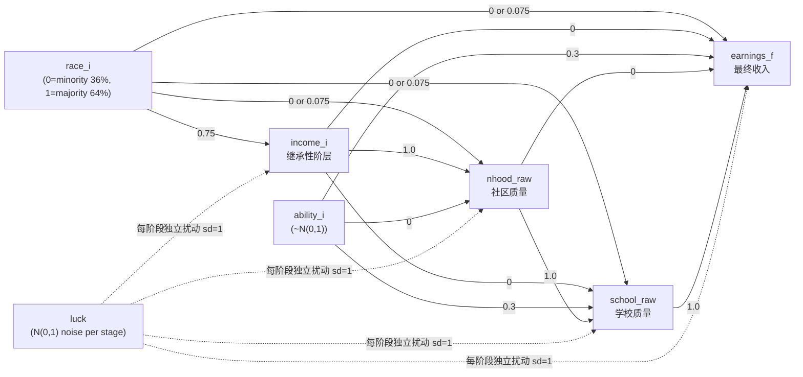

**关键路径解读**：

- **间接路径**（红色粗线）：`race → income → nhood → school → earnings` = 0.75 × 1.0 × 1.0 × 1.0 = 种族通过阶层继承所产生的全部间接种族效应
- **直接路径**（三条蓝线）：种族在各制度准入阶段遭受的歧视，总和为 3 × 0.075 = 0.225
- **能力路径**：`ability → school → earnings` + `ability → earnings` = 0.3 × 1.0 + 0.3 = 能力的总效应
- **阶层完全中介**：`income` 对 `school` 和 `earnings` 的直接效应均为 0，完全通过 `nhood` 中介
- **社区完全中介**：`nhood` 对 `earnings` 的直接效应为 0，完全通过 `school` 中介

### 1.2 代理人观测模型的DAG（取决于社会世界类型）

```mermaid
graph TD
    subgraph 整合世界（随机网络）
        direction LR
        r1[race] --> i1[income] --> n1[nhood] --> s1[school] --> e1[earnings]
        a1[ability] --> e1
        a1 --> s1
    end
```

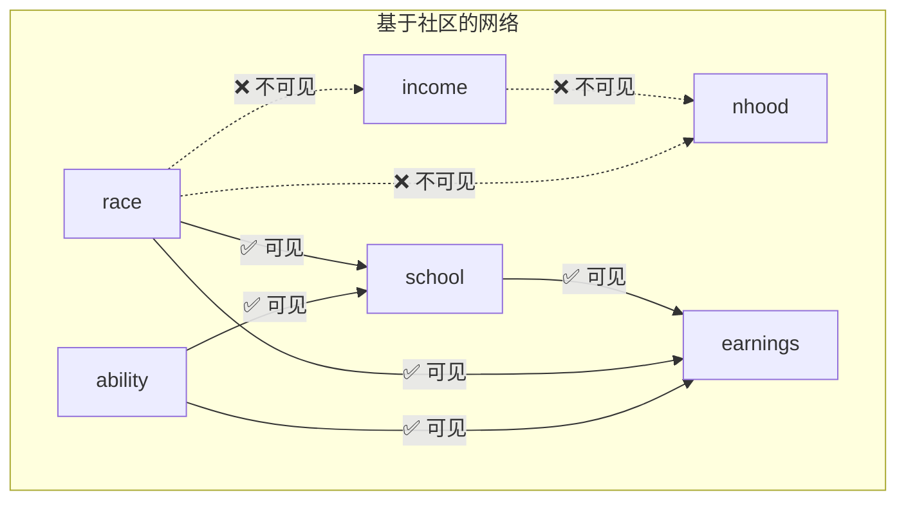

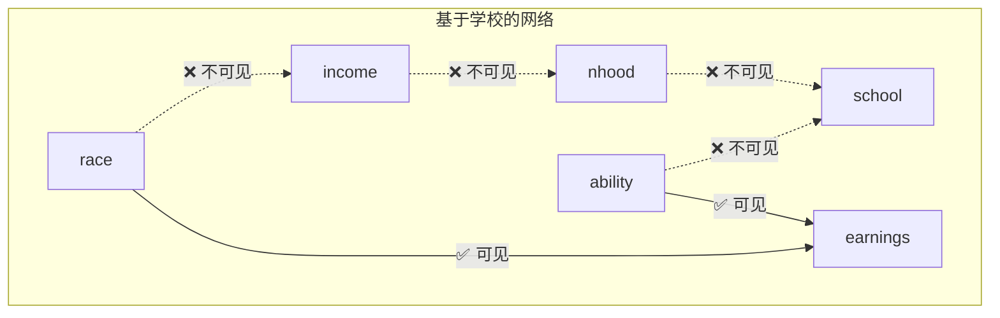

```mermaid
graph TD
    subgraph 基于收入的网络（最极端）
        direction LR
        r4[race] -.->|"❌ 全遮蔽"| i4[income]
        i4 -.->|"❌ 全遮蔽"| n4[nhood]
        n4 -.->|"❌ 全遮蔽"| s4[school]
        s4 -.->|"❌ 全遮蔽"| e4[earnings]
        a4[ability] -.->|"❌ 全遮蔽"| e4
    end
```

| 社会世界 | 可见因果路径 | 被遮蔽因果路径 | 推断偏差严重程度 |
|---------|-------------|---------------|:---:|
| 随机/整合 | 全部路径 | 无 | ★ (无偏差) |
| 基于社区 | race→school, race→earnings, ability→school, ability→earnings, school→earnings | race→income, income→nhood, race→nhood, nhood→school | ★★ |
| 基于学校 | race→earnings, ability→earnings | race→income, income→nhood, race→nhood, race→school, ability→school, nhood→school | ★★★ |
| 基于收入 | 几乎无 | 全部因果链 | ★★★★ (极端) |

---

## 二、逐阶段变量流程全景图

### Stage 0: 代理人初始化

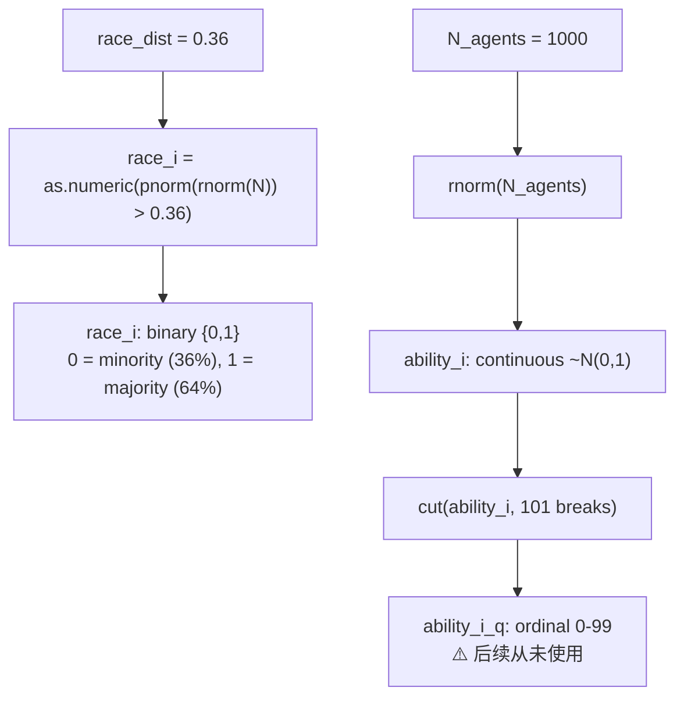

### Stage 1: 继承性阶层（= 论文中的 "class"）

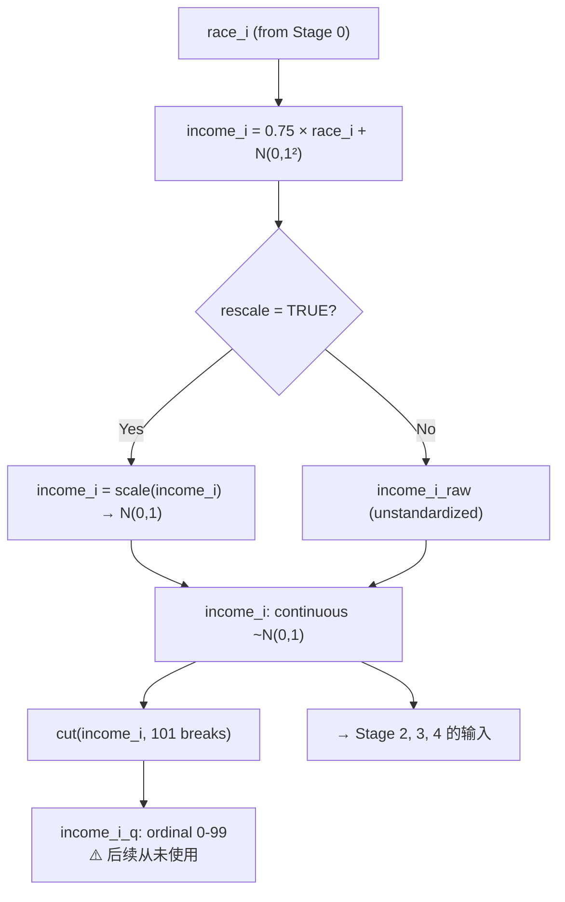

### Stage 2: 社区分层

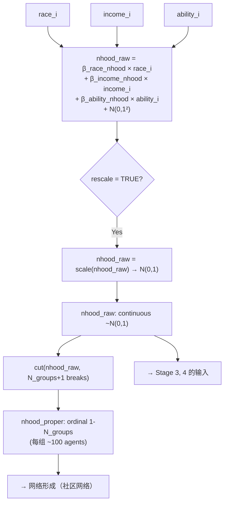

### Stage 3: 学校分层

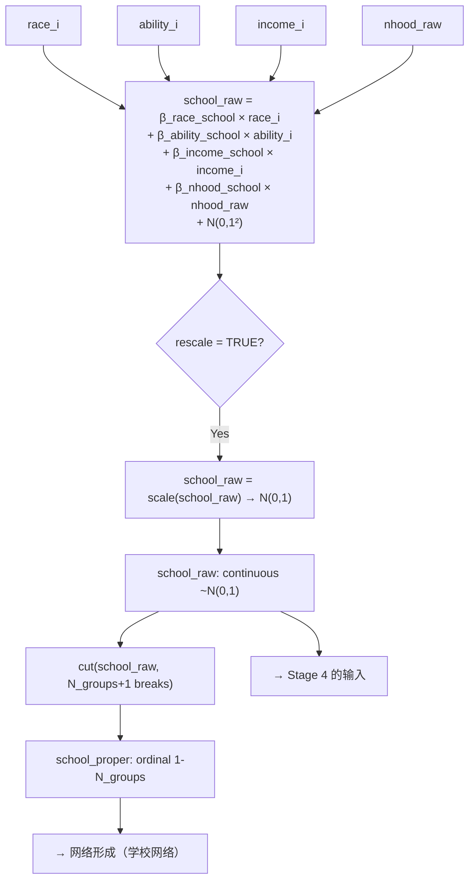

### Stage 4: 最终收入

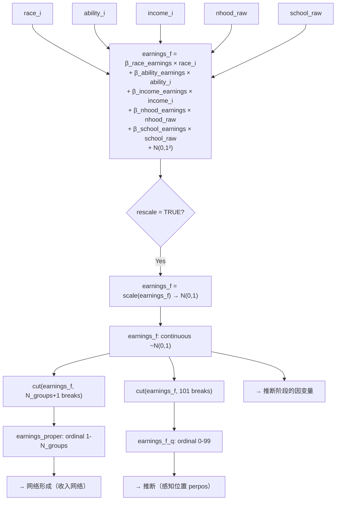

### 变量流转总图

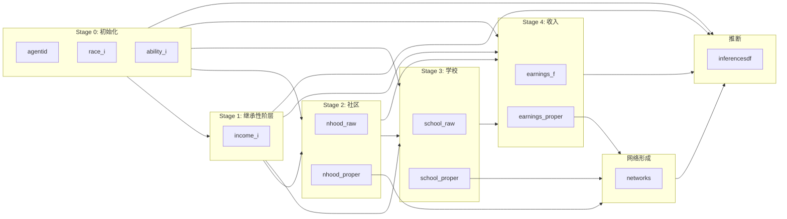

---

## 三、参数变量对照表

### 3.1 仿真参数（loopdf列）

| 参数名（代码） | 默认值 | 论文中的对应概念 | 含义 |
|---------------|--------|-----------------|------|
| `seed` | 1:100 | "hundred simulations" | 蒙特卡洛种子 |
| `N_agents` | 1000 | "1,000 agents" | 代理人总数 |
| `netsize` | 100 | "100 others" | 网络规模（≈潜在连接数） |
| `friendsize` | 0.8 | "80% of the agents" | 实际连接比例 |
| `race_dist` | 0.36 | "36% of agents" | 少数种族比例（1 − 非西裔白人） |
| `beta_race_income` | 0.75 | "indirect effect of race" | 种族 → 继承性阶层 = 间接种族效应 |
| `beta_income_nhood` | 1 | "class → neighborhood" | 阶层 → 社区质量 |
| `beta_race_nhood` | 0 / 0.075 | "discrimination in housing" | 种族 → 社区（歧视） |
| `beta_ability_nhood` | 0 | (ability doesn't affect nhood) | 能力 → 社区（=0，设计如此） |
| `beta_income_school` | 0 | (class → school: fully mediated) | 阶层 → 学校（=0，通过社区完全中介） |
| `beta_ability_school` | 0.3 | "ability → school" | 能力 → 学校 |
| `beta_race_school` | 0 / 0.075 | "discrimination in admissions" | 种族 → 学校（歧视） |
| `beta_nhood_school` | 1 | "neighborhood → school" | 社区质量 → 学校 |
| `beta_income_earnings` | 0 | (class → earnings: fully mediated) | 继承性阶层 → 最终收入（=0） |
| `beta_ability_earnings` | 0.3 | "ability → earnings" | 能力 → 最终收入 |
| `beta_race_earnings` | 0 / 0.075 | "discrimination in labor market" | 种族 → 最终收入（歧视） |
| `beta_nhood_earnings` | 0 | (nhood → earnings: fully mediated) | 社区 → 最终收入（=0） |
| `beta_school_earnings` | 1 | "school → earnings" | 学校质量 → 最终收入 |
| `network_formation` | 'smallworld' | "small-world networks" | 网络拓扑算法 |
| `network_stage` | 'random'/'nhood'/'school'/'earnings' | "segregated social worlds" | 网络形成所在的制度阶段 |
| `luck` | 1 | "how much luck matters" | 各阶段随机噪声标准差 |
| `rescale` | TRUE | "rescale all vars to N(0,1)" | 是否在每阶段标准化变量 |
| `main` | "main" / 稳健性标签 | "robustness checks" | 模拟场景类型标签 |

### 3.2 关键派生参数（代码内计算）

| 变量名 | 计算公式 | 含义 |
|--------|---------|------|
| `N_groups` | N_agents / netsize = 1000 / 100 = 10 | 社区/学校/收入组的数量 |
| `smallw_factor` | netsize / ((friendsize × netsize) / 2) = 100 / 40 = 2.5 | 小世界网络邻域参数 |
| `random_factor` | friendsize = 0.8 | 随机网络连接比例 |
| `race_indirect` | 0.75 | 全局常量：间接种族效应 |

---

## 四、代理人变量完整清单

### 4.1 agentsdf 结构

| 变量名 | 类型 | 生成阶段 | 含义 | 流向 |
|--------|------|---------|------|------|
| `agentid` | int 1:1000 | Stage 0 | 代理人唯一标识 | 全程使用 |
| `race_i` | binary {0,1} | Stage 0 | 种族: 0=少数(36%), 1=多数(64%) | Stage 1–4 输入; 推断的预测变量 |
| `ability_i` | continuous ~N(0,1) | Stage 0 | 天赋能力 | Stage 2–4 输入; 推断的预测变量 |
| `ability_i_q` | ordinal 0–99 | Stage 0 | 能力百分位等级 | 生成后从未使用 |
| `income_i` | continuous ~N(0,1) (若rescale) | Stage 1 | 继承性阶层/父母收入（论文称 "class"） | Stage 2–4 输入; 推断的预测变量 |
| `income_i_q` | ordinal 0–99 | Stage 1 | 阶层百分位等级 | 生成后从未使用 |
| `nhood_raw` | continuous ~N(0,1) (若rescale) | Stage 2 | 社区质量（连续） | Stage 3–4 输入 |
| `nhood_proper` | ordinal 1–N_groups | Stage 2 | 社区分配（离散） | 网络形成（社区网络） |
| `school_raw` | continuous ~N(0,1) (若rescale) | Stage 3 | 学校质量（连续） | Stage 4 输入 |
| `school_proper` | ordinal 1–N_groups | Stage 3 | 学校分配（离散） | 网络形成（学校网络） |
| `earnings_f` | continuous ~N(0,1) (若rescale) | Stage 4 | 最终收入（因变量） | 推断的因变量 |
| `earnings_proper` | ordinal 1–N_groups | Stage 4 | 收入组（离散） | 网络形成（收入网络） |
| `earnings_f_q` | ordinal 0–99 | Stage 4 | 收入百分位等级 | 推断（感知位置 perpos） |
| `i` | int | 后处理 | 模拟运行编号（来自loopdf） | 数据合并的键 |

---

## 五、推断结果变量对照表

### 5.1 inferencesdf 结构

| model 值 | var 值 | mu 的含义 | 论文对应 |
|-----------|--------|----------|---------|
| `inequality` | "var" | 代理人网络中 earnings_f 的方差 | Panel A: 感知的不平等程度 |
| `totalss` | "var" | Σ(earnings − mean)² | 总平方和（用于分解） |
| `withins` | "var" | 种族组内平方和 | 组内不平等 |
| `betweenss` | "var" | 种族组间平方和 | Panel B: 种族间不平等 |
| `perpos` | "var" | 代理人在其网络收入分布中的百分位 | （非主要关注） |
| `normal` | `(Intercept)` | 完整OLS模型的截距 | — |
| `normal` | `race_i` | 完整OLS中 race_i 的系数 | Panel B/C: 种族的条件（直接）效应 |
| `normal` | `income_i` | 完整OLS中 income_i 的系数 | Panel B: 阶层总效应 |
| `normal` | `ability_i` | 完整OLS中 ability_i 的系数 | Panel B: 能力总效应 |
| `normal` | `r2` | 完整OLS的 R² | Panel C: 运气估计 = 1 − R² |
| `normal` | `adjr2` | 完整OLS的调整 R² | — |
| `normal` | `rss` | 残差平方和 | — |
| `normal` | `ess` | 解释平方和 | — |
| `normal` | `tss` | 总平方和 | — |
| `race` | `race_i` | race-only OLS 的 race_i 系数 | Panel A: 种族总效应（无条件） |
| `race` | `r2`, `adjr2`, `rss`, `ess`, `tss` | 同 normal 模型对应统计量 | — |

### 5.2 推断模型详解

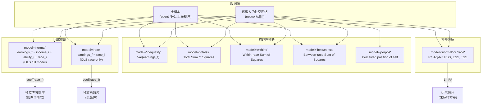

---

## 六、命名与设计分析

### 6.1 核心命名差异：`income_i` vs 论文中的 "class"

代码中最显著的概念-命名偏差是：代码使用 `income_i` 表示"继承性阶层位置"，而论文始终将其称为 **"class"** 或 **"inherited class position"**。这一差异贯穿整个代码库：

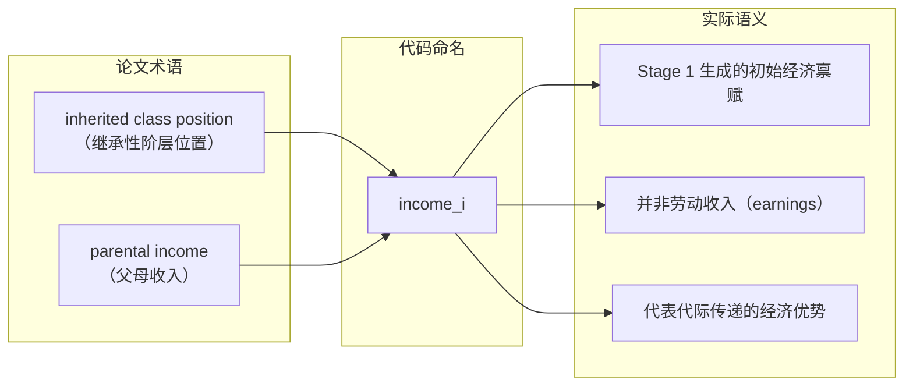

该命名偏差导致一组参数名称在字面上具有误导性：

| 参数名（代码） | 字面意思 | 实际含义（论文一致解读） |
|---------------|---------|---------------------|
| `beta_race_income` | "种族对**收入**的效应" | 种族对**继承性阶层**的效应（间接种族效应） |
| `beta_income_nhood` | "**收入**对社区的影响" | **继承性阶层**对社区的影响 |
| `beta_income_school` | "**收入**对学校的影响" | **继承性阶层**对学校的直接影响 |
| `beta_income_earnings` | "**收入**对收入的影响" | **继承性阶层**对最终劳动收入的直接效应 |

**理解建议**：阅读代码时，将 `income_i` 始终理解为 "inherited class / parental income"，将 `earnings_f` 理解为 "final earnings from labor market"。`02_results.R` 的标签映射中将 `income_i` 翻译为 "Class" 是正确的，印证了这一解读。

### 6.2 种族变量 `race_i` 的编码方向

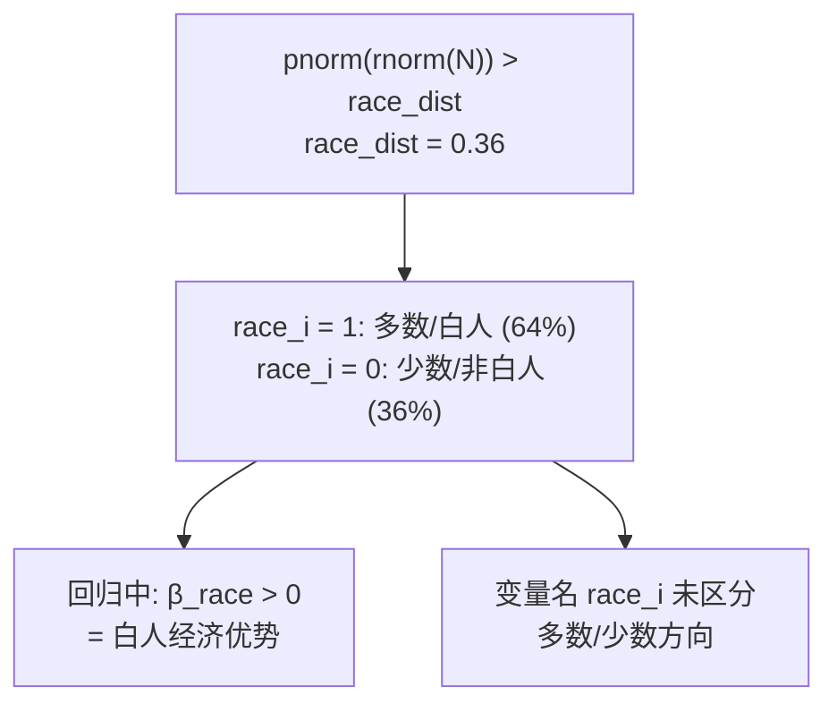

`race_dist = 0.36` 这个参数名暗示少数种族占比 36%，但实际赋值让多数群体 = 1。注释 `#1 - white, nonhispanics in the USA` 明确了 1 = 白人。在回归中 β_race > 0 表示白人优势，社会学解释正确。但 `race_i` 这个中性名称不携带方向信息，建议阅读时始终记住 **1=白人多数，0=少数群体**。

### 6.3 匿名变量：`ability_i_q` 和 `income_i_q`

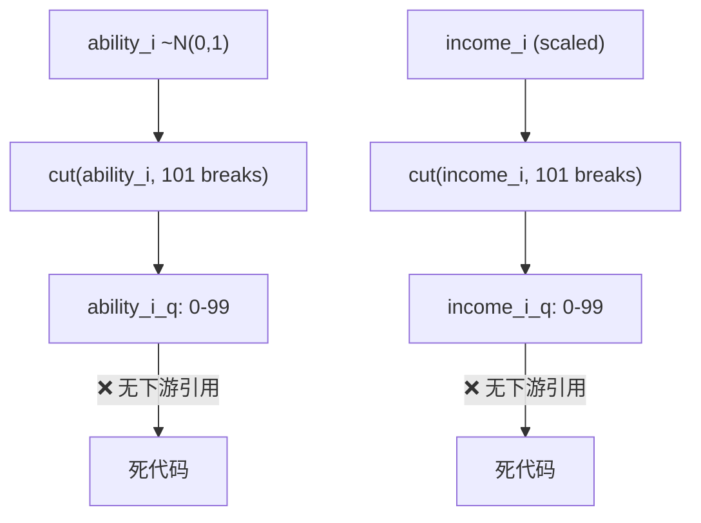

代码中生成了 `ability_i_q` 和 `income_i_q` 两个百分位等级变量，但在后续所有仿真方程（Stage 2–4）和推断回归中均使用连续原始变量。这两个变量很可能是开发过程中的遗迹（作者可能曾考虑使用离散百分位替代连续值来避免异常值影响，最终选择了连续值 + 标准化的方案）。它们不产生任何计算错误，但增加了不必要的内存占用。

### 6.4 R² 与 "Luck" 标签的语义转换

`02_results.R` 中有一段关键的语义转换，阅读时需要留意：

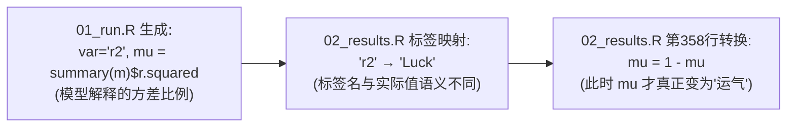

推断阶段存储的是 R²（模型解释的方差比例），而在结果可视化前通过 `1 - mu` 转换为未解释方差（即论文定义的"运气"）。标签 "Luck" 仅在转换后的上下文中正确。阅读中间数据时需注意 `var='r2'` 的 `mu` 列实际上是 R² 而非运气。

### 6.5 结果分析脚本中的变量标签映射

`02_results.R` 的标签映射表包含了以下条目，其中部分条目指向未在推断引擎中生成的变量：

| 代码 var 值 | 标签映射 | 是否在推断中生成 | 说明 |
|------------|---------|:---:|------|
| `(Intercept)` | "Intercept" | ✅ | OLS 截距 |
| `race_i` | "Race" | ✅ | 回归中种族的系数 |
| `income_i` | "Class" | ✅ | 回归中阶层的系数 |
| `ability_i` | "Ability" | ✅ | 回归中能力的系数 |
| `adjr2` | "Luck (Adj.)" | ✅ | 调整 R² |
| `r2` | "Luck" | ✅ | R²（转换后为运气） |
| `tss` | "Total SS" | ✅ | 总平方和 |
| `rss` | "Residual SS" | ✅ | 残差平方和 |
| `ess` | "Estimated SS" | ✅ | 解释平方和 |
| `nhood_raw` | "Neighborhood" | ❌ | 推断引擎从未将此作为 var 值输出 |
| `school_raw` | "School" | ❌ | 推断引擎从未将此作为 var 值输出 |
| `logvar` | "Inequality" | ❌ | 代码库中完全不存在此变量的生成逻辑 |

`nhood_raw` 和 `school_raw` 标签映射可能是早期版本中包含这些变量作为回归预测变量的残余（当前回归仅使用 `income_i + ability_i + race_i`）。`logvar` 完全不存在于代码逻辑中，可能是计划中但从未实现的对数方差变量。这些无效条目不影响运行（从未被匹配到），但会使维护者困惑。

### 6.6 `N_groups` 与 `netsize` 的隐性耦合

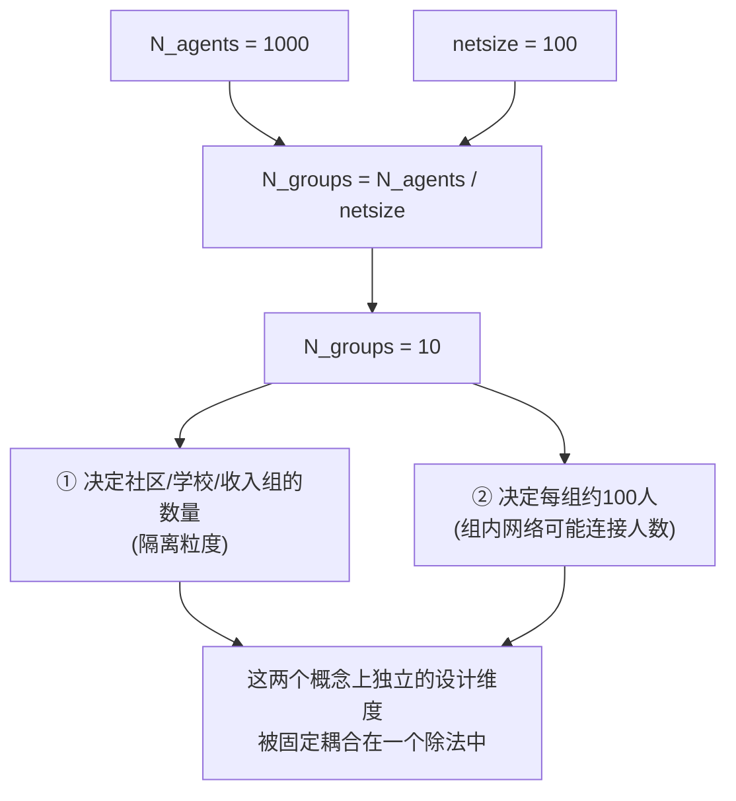

这一设定意味着改变 `netsize` 同时改变了社交网络的规模和隔离的粒度，导致无法独立研究这两个维度对推断偏差的分别影响。例如将 `netsize` 从 100 改为 50 会同时使连接数减半和分组数加倍。

### 6.7 连续质量 vs 离散分配的"双轨制"

模型中每个制度存在两个版本的变量，服务于不同的目的：

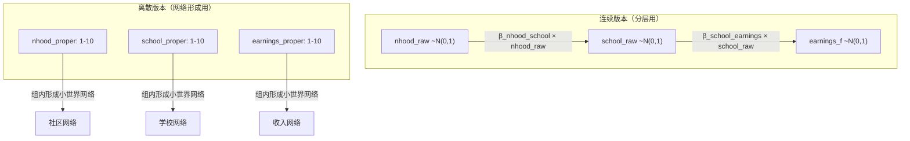

**设计逻辑**：连续变量反映同一社区/学校内部的异质性（如住房大小、设施差异、学校间的细微质量差异），离散变量则代表代理人实际被分配到哪个社会圈子，在其内部形成社交关系。这一双轨制是合理且精细的，但论文和代码注释均未明确说明该设计。

---

## 七、论文-代码术语映射表

下表建立了论文文本中使用的概念与代码变量/函数/参数之间的精确对应关系：

| 论文概念（英文） | 论文概念（中文） | 代码变量/参数 | 代码位置 |
|----------------|----------------|-------------|---------|
| inherited class position | 继承性阶层位置 | `income_i` | 01_run.R:224 |
| parental income | 父母收入 | `income_i`（论文为避免与 earnings 混淆而使用 "class"） | 同上 |
| final earnings | 最终收入 | `earnings_f` | 01_run.R:288 |
| ability / innate attribute | 天赋能力 | `ability_i` | 01_run.R:206 |
| minority status (36%) | 少数种族身份 | `race_i == 0` | 01_run.R:211 |
| majority / white / dominant race | 多数/白人/优势种族 | `race_i == 1` | 同上 |
| indirect effect of race | 种族的间接效应 | `beta_race_income = 0.75` | 01_run.R:56, 73 |
| discrimination in neighborhoods | 社区准入歧视 | `beta_race_nhood` | 01_run.R:76 |
| discrimination in schools | 学校准入歧视 | `beta_race_school` | 01_run.R:81 |
| discrimination in labor market | 劳动力市场歧视 | `beta_race_earnings` | 01_run.R:86 |
| neighborhood quality (continuous) | 连续社区质量 | `nhood_raw` | 01_run.R:238 |
| neighborhood assignment (discrete) | 离散社区分配 | `nhood_proper` | 01_run.R:255 |
| school quality (continuous) | 连续学校质量 | `school_raw` | 01_run.R:262 |
| school assignment (discrete) | 离散学校分配 | `school_proper` | 01_run.R:281 |
| formative institutions | 形成性制度 | neighborhood / school / earnings 三阶段 | Stage 2–4 |
| small-world networks | 小世界网络 | `network_formation = 'smallworld'` | 01_run.R:90 |
| social world / network type | 社会世界/网络类型 | `network_stage` | 01_run.R:91 |
| integrated network | 整合网络 | `network_stage = 'random'` | 01_run.R:91 |
| neighborhood-based network | 基于社区的网络 | `network_stage = 'nhood'` | 同上 |
| school-based network | 基于学校的网络 | `network_stage = 'school'` | 同上 |
| earnings-based network | 基于收入的网络 | `network_stage = 'earnings'` | 同上 |
| descriptive inference (inequality) | 描述性推断（不平等） | `model = 'inequality'` | 01_run.R:508 |
| causal inference (coefficients) | 因果推断（系数） | `model = 'normal'`（全模型） | 01_run.R:535 |
| total effect of race | 种族总效应 | `model = 'race'`, var = `race_i` | 01_run.R:567 |
| direct effect of race | 种族直接效应 | `model = 'normal'`, var = `race_i` | 01_run.R:535 |
| luck / unexplained variance | 运气/未解释方差 | 1 − mu[var == 'r2'] | 02_results.R:358 转换 |
| perceived position | 感知的社会位置 | `model = 'perpos'` | 01_run.R:512 |
| between-race inequality share | 种族间不平等占比 | `betweenss / totalss` | 01_run.R:520–521 |
| redistribution preferences | 再分配偏好 | `phat`（inverse-logit score） | 03_results_redistribution.R:206 |
| ground truth (God's estimate) | 基准真实值 | agent N+1（j = N_agents + 1） | 01_run.R:482, 493–495 |
| Monte Carlo seeds | 蒙特卡洛种子 | `seed = 1:100` | 01_run.R:62 |
| robustness checks | 稳健性检验 | `main != "main"` 的参数组合 | 01_run.R:129–175 |
| yes-discrimination world | 有歧视世界 | `world = 'yesdiscrimination'` | 02_results.R:173–177 |
| no-discrimination world | 无歧视世界 | `world = 'nodiscrimination'` | 同上 |
